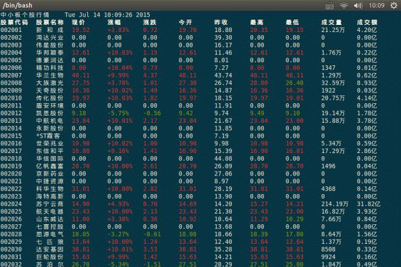

## Blackbird-A股神器(A Niubility China Stock Tools)
Blackbird是一款茁壮成长的A股神器，目前支持Linux, 有任何建议或意见，欢迎联系[Steve](mailto:zhongsizhi@foxmail.com)。

### Demo -- 行情模拟器(mdsim)

### Build && Usage

1. Linux下编译参考[wiki](https://github.com/subler/Blackbird/wiki/Blackbird%E7%BC%96%E8%AF%91%E6%8C%87%E5%8D%97(Linux))
2. 拷贝基础数据

        cp -r data/ build/bin/
3. 拷贝配置文件

        cp config/*.xml build/bin/
4. 运行程序

        ./mdsim -c mdsim.xml
5. 输入命令和参数

        # 沪市现价前10股票
        --bk sh -T 10 -O xj
    查看实时行情，可按`q`退出。

**mdsim**用于查看实时行情，提供功能如下：

        -H [ --help ]         显示帮助信息
        -Q [ --quit ]         退出程序
        --code arg            查看个股信息，代码用','分开
        -c [ --config ] arg   设置配置文件
        --bk arg              批量显示行情
            可能值(沪|深|创|中小|全部): sz|sh|cyb|zxb|all
        -M [ --market ]       显示大盘行情
            沪市|深市|创业板
        -T [ --top ] arg      筛选前几个信息
        -O [ --order ] arg    排序规则
            可能值:
                正序： zdf(涨跌幅)|xj(现价)|cjl()|cje(成交额)
                逆序： zdfi|xji|cjli|cjei
        --add-option arg      追加自选股,股票代码用','分开
        --del-option arg      删除自选股,股票代码用','分开
        --show-option         查看自选股
